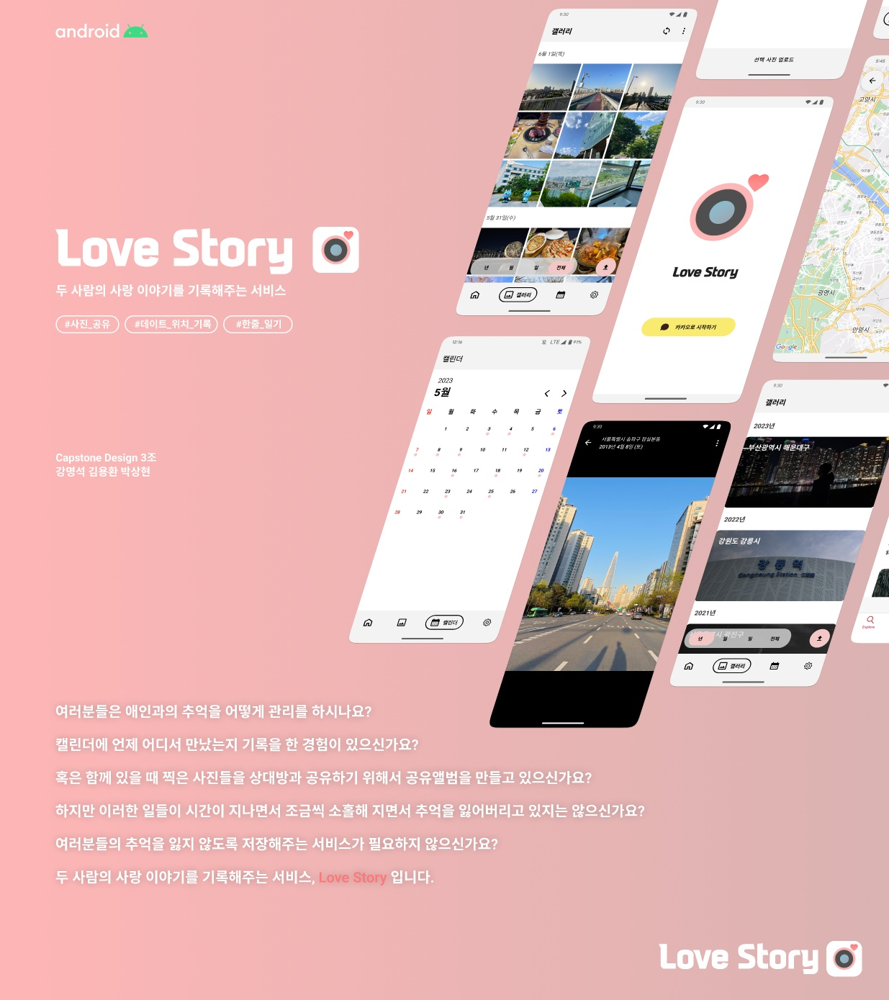
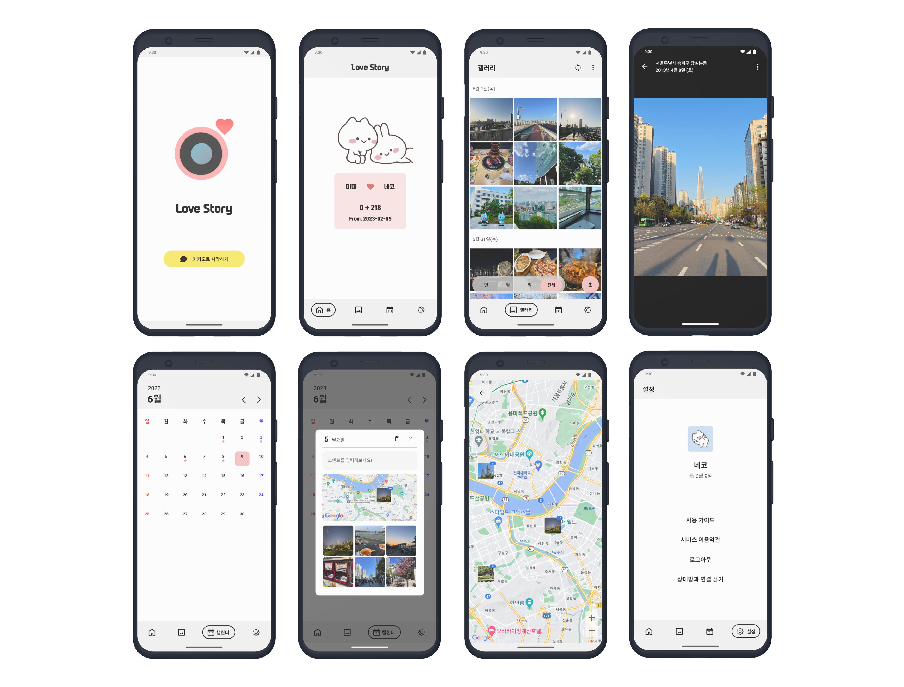

# **LoveStory - 커플 추억 자동 기록 앱**

<p align="center"></p>

## :computer:**Architecture**
<p align="center"></p>


## UX/UI
<p align="center"></p>


## Directory
```swift
Lovestory
 ├── api
 ├── broadcasts
 ├── database
 │   ├── entities
 │   └── repository
 ├── graphs
 ├── model
 ├── module
 │   ├── auth
 │   ├── dashboard
 │   ├── map
 │   ├── photo
 │   └── shared
 ├── network
 ├── resource
 ├── services
 ├── ui
 │   ├── components
 │   ├── screens
 │   └── theme
 ├── view
 └── MainActivity.kt
```
